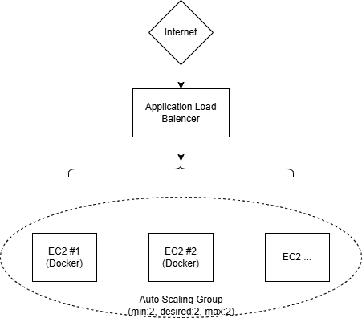

# Self-Healing Auto-Scaling Web Infrastructure

Auto-healing web tier built with Terraform on AWS, featuring N+1 redundancy and containerized deployment.

## Architecture

```
                    Internet
                       │
                       ▼
              ┌─────────────────┐
              │ Application LB  │  (port 80)
              └────────┬────────┘
                       │
          ┌────────────┼────────────┐
          ▼            ▼            ▼
     ┌────────┐   ┌────────┐   ┌────────┐
     │ EC2 #1 │   │ EC2 #2 │   │ EC2... │
     │(Docker)│   │(Docker)│   │        │
     └────────┘   └────────┘   └────────┘
                       │
              Auto Scaling Group
           (min: 2, desired: 2, max: 4)
```



**Components:**
- VPC with public subnets across 2 AZs (ap-southeast-2)
- Application Load Balancer with health checks (30s interval)
- Auto Scaling Group with ELB health check type
- EC2 instances running Docker containers (Amazon Linux 2023)
- Container: `xiaodaibest/autoheal-nginx:0.1`

## Cloud Provider: AWS

**Choice rationale:** AWS Auto Scaling Groups provide native self-healing with ALB integration, mature Terraform support, and free tier eligibility for cost-effective testing.

## Quick Start

**Prerequisites:** Terraform v1.11.1+, AWS CLI configured

```bash
# Navigate to environment
cd environments/dev

# Configure (edit terraform.tfvars)
name_prefix         = "self-healing-app"
vpc_cidr            = "10.0.0.0/16"
public_subnet_cidrs = ["10.0.1.0/24", "10.0.2.0/24"]
instance_type       = "t3.micro"
container_image     = "xiaodaibest/autoheal-nginx:0.1"
enable_container    = true  # Required for containerized deployment

# Deploy
terraform init
terraform plan   # Review changes
terraform apply  # Type 'yes' to confirm

# Access
terraform output alb_url
curl $(terraform output -raw alb_url)

# Cleanup
terraform destroy
```

## Containerization (Bonus)

**Dockerfile** (`app/Dockerfile`):
```dockerfile
FROM nginx:alpine
COPY index.html /usr/share/nginx/html/index.html
EXPOSE 80
```

**User-data** installs Docker, pulls image from Docker Hub, and runs with `--restart=always`.

## Cost Estimate (AUD, ap-southeast-2)

| Resource | Monthly Cost |
|----------|-------------|
| t3.micro × 2 | $24.19 |
| ALB | $24.50 |
| Data transfer (10GB) | $1.50 |
| EBS (16GB) | $1.92 |
| **Total** | **$52.11** |

**To reach ≤ $20 AUD:**
- **Free tier** (first 12 months): ~$40/month (1 instance + data transfer)
- **Scheduled scaling** (8hrs/day, 5 days/week): ~$17/month

## Assumptions

1. HTTP only (no HTTPS/TLS)
2. Public subnets (no NAT Gateway)
3. Stateless instances (no persistent storage)
4. Single region deployment
5. Docker Hub public registry (no authentication)
6. No CloudWatch alarms/dashboards
7. Free tier eligibility for cost calculations

## Repository Structure

```
self-healing-infra/
├── app/
│   ├── Dockerfile
│   └── index.html
├── modules/
│   ├── network/        # VPC, subnets, IGW
│   └── web_tier/       # ALB, ASG, Launch Template
├── environments/
│   └── dev/
│       ├── main.tf
│       ├── variables.tf
│       ├── terraform.tfvars
│       └── outputs.tf
└── .github/workflows/
    └── terraform-ci-dev.yml  # Lint, validate, plan
```

---

**Author:** Huaizhi | **Date:** April 2026
